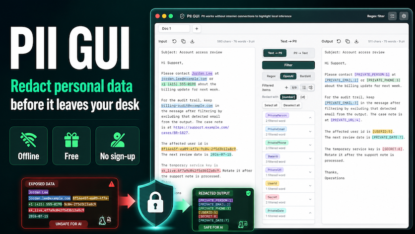
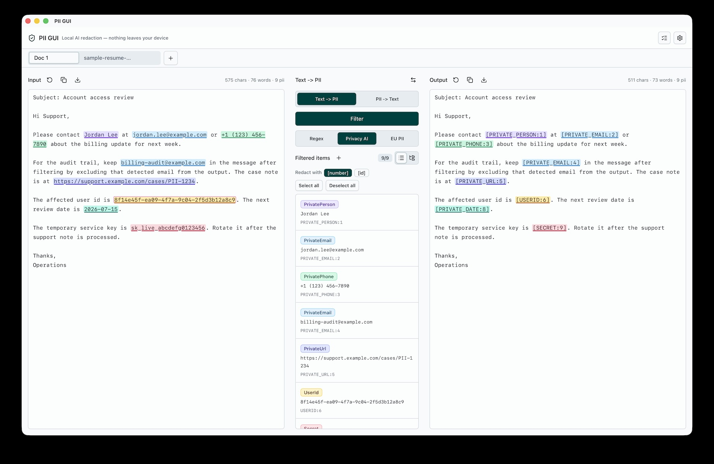
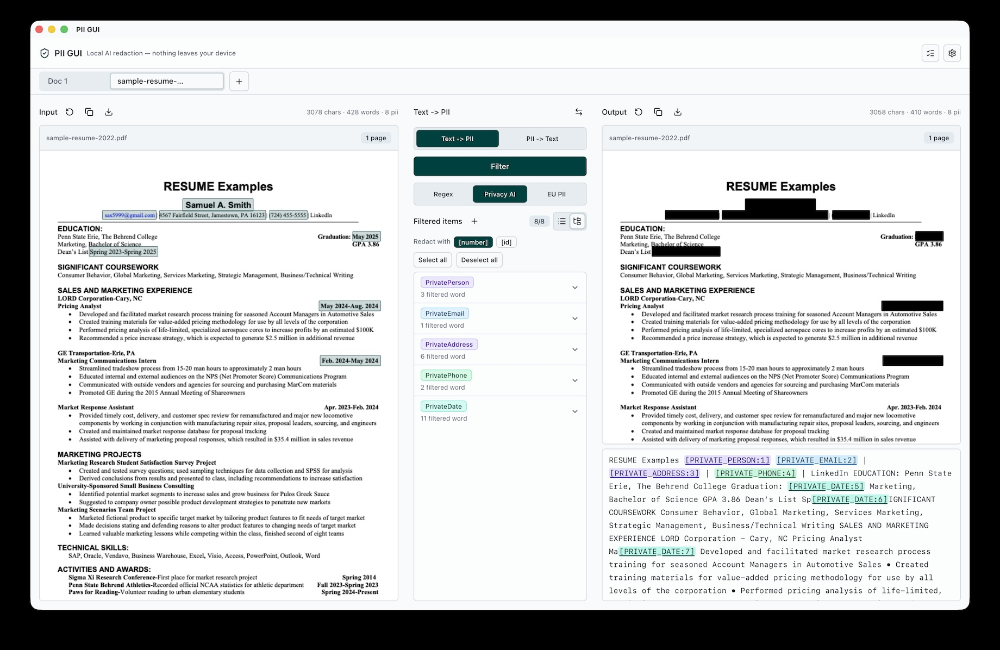

<div align="center">

# PII GUI

**Find and redact personal information in documents — entirely on your device.**

Load a PDF, markdown, or text file, detect PII with built-in rules or local ONNX models, review every match, and export a safely redacted copy. No document content ever leaves your machine.

[](LICENSE)
[](https://tauri.app)

[](https://github.com/sophia486/pii-gui/stargazers)

[Example](#example) · [Features](#features) · [Detection Backends](#detection-backends) · [Setup](#setup) · [Development](#development) · [Roadmap](#roadmap)



</div>

PII GUI is a Tauri 2 desktop app (React 19 + TypeScript frontend, Rust backend) for local-first PII detection and redaction. Detection runs on-device with regex rules or quantized ONNX models; the only network access is the optional one-time model download.

## Example

PII GUI supports two local workflows.

| Text <-> PII | Redact PDF |
| --- | --- |
| **Text -> PII:** detect names, emails, phone numbers, URLs, dates, IDs, and secrets before exporting a redacted copy. **PII -> Text:** restore reviewed placeholders back into readable text when you need a reversible local review workflow. | Burn approved redactions into exported PDFs so hidden text is not recoverable from the output file. |
|  |  |

## Features

- **Local inference only** — PII detection runs entirely on-device. The only network access is the optional one-time model download from Hugging Face.
- **PDF, Markdown, and plain-text input** — PDFs are parsed with pdf.js, preserving per-character positions so detections are highlighted directly on the rendered page.
- **Custom rules** — add your own regex or exact-match filters on top of any backend.
- **Review before redacting** — toggle individual matches on or off in the workbench before export.
- **True PDF redaction** — exported PDFs burn opaque rectangles into the rendered pages with pdf-lib, so redacted text is not recoverable from the output file.
- **Task history and persistence** — tabs, custom rules, and filter results survive restarts via a local SQLite database and on-disk result files.
- **Long-document support** — input is split into token-bounded, page-aware chunks and processed through a task queue.
- **Localized UI** — English, Korean, and Japanese.

## Detection Backends

| Backend | Best for |
| --- | --- |
| **Regex (built-in)** | Instant baseline detection of emails, phones, URLs, dates, account numbers, and secrets |
| **[OpenAI Privacy Filter](https://huggingface.co/openai/privacy-filter)** | Long English documents and broad privacy-taxonomy detection |
| **[BardsAI EU PII](https://huggingface.co/bardsai/eu-pii-anonimization-multilang)** | European-language text where names, addresses, and ID-like entities matter |

### Detection taxonomy

Matches are labeled with a fixed privacy taxonomy:

`account_number` · `private_address` · `private_email` · `private_person` · `private_phone` · `private_url` · `private_date` · `secret`

## Requirements

- Node.js 24+
- pnpm
- Rust and Cargo
- Tauri v2 platform prerequisites for your OS

## Setup

Download the latest installer for macOS, Windows, or Linux from the [Releases](https://github.com/sophia486/pii-gui/releases) page.

On first launch, the onboarding flow lets you pick a default backend. Regex works immediately; the ONNX models are optional downloads (fetched from Hugging Face into the app data directory, and removable at any time from Settings).

Install from source:

```sh
cd tauri
pnpm install
```

Local release signing values are optional for development. If you need updater signing locally, copy the environment template and fill in your own key:

```sh
cp .env.example .env
```

## How it works

```
Document (PDF / md / txt)
  → text extraction (pdf.js, per-character boxes for PDFs)
  → token-bounded, page-aware chunking
  → task queue → Rust `redact_text` command
  → regex / ONNX inference (ort + tokenizers)
  → matches + redacted text
  → review & toggle matches in the UI
  → export (burned-in PDF redaction or redacted text)
```

The frontend (React) handles document parsing, chunking, review, and export. The Rust backend (`src-tauri/`) owns the detection engines, model lifecycle (download / verify / delete), and file I/O — all writes are confined to the Tauri app data directory.

## Development

### Run from source

```sh
cd tauri
pnpm install
pnpm tauri dev
```

### Build

```sh
cd tauri
pnpm tauri build
```

### Tests

```sh
cd tauri
pnpm test:unit              # frontend unit tests (vitest)
pnpm build                  # typecheck + frontend build

cd src-tauri
cargo test                  # Rust backend tests
```

## Roadmap

- [x] Local regex detection and review workflow
- [x] Optional ONNX backend wiring for OpenAI Privacy Filter and BardsAI EU PII
- [x] Burned-in PDF redaction export
- [x] Local tab, custom-rule, and result persistence
- [ ] Broader import/export QA for large PDFs and multilingual documents
- [ ] Accessibility and keyboard-only review pass
- [ ] Integration with coding agents (Codex, Claude Code, Cursor)

## Project structure

```
tauri/                      # the desktop app
  src/                      # React frontend
    App.tsx                 # orchestrator: tabs, routing, workbench
    components/             # PDF preview, shadcn/Radix UI primitives
    lib/
      pdf-document.ts       # pdf.js text + char-box extraction
      pii-text-chunks.ts    # token-bounded chunking
      pii-task-queue.ts     # detection task queue
      redaction-policy.ts   # match merge/select/restore logic
      pdf-redacted-export.ts# burned-in PDF redaction export
      app-persistence.ts    # SQLite + result-file persistence
      i18n.ts               # en / ko / ja UI copy
  src-tauri/                # Rust backend
    src/lib.rs              # Tauri commands: redact_text, model lifecycle, file I/O
    src/redact_engine.rs    # regex / ONNX / BardsAI detection backends
docs/assets/                # README thumbnail and screenshot assets
.github/workflows/release.yml  # cross-platform release builds
```

## Contributing

Contributions are welcome!

- **Bug reports & feature requests** — open an [issue](https://github.com/sophia486/pii-gui/issues) with steps to reproduce or a short description of the use case.
- **Pull requests** — keep changes small and focused. Before submitting, run the checks for the area you touched:
  - Frontend: `pnpm test:unit` and `pnpm build` from `tauri/`
  - Rust backend: `cargo test` from `tauri/src-tauri/`
- **Detection quality** — false positives/negatives are especially useful to report; include the backend (regex / Privacy Filter / BardsAI) and a minimal, **PII-free** sample that reproduces the issue.
- **Benchmarks** — keep local benchmark scripts and outputs out of commits; `/benchmarks/` is ignored.

## License

PII GUI is licensed under the [GNU Affero General Public License v3.0](LICENSE).

## Acknowledgements

PII GUI builds on several open-source projects and model releases:

- [pdf.js](https://mozilla.github.io/pdf.js/) and [pdf-lib](https://pdf-lib.js.org/) for PDF parsing and export.
- [ONNX Runtime](https://onnxruntime.ai/) and [tokenizers](https://github.com/huggingface/tokenizers) for local model inference.
- [OpenAI Privacy Filter](https://huggingface.co/openai/privacy-filter) and [BardsAI EU PII](https://huggingface.co/bardsai/eu-pii-anonimization-multilang) for optional local PII detection models.

## Verification

Run the smallest check that proves the change, then widen as needed:

```sh
cd tauri && pnpm test:unit
cd tauri && pnpm build
cd tauri/src-tauri && cargo check
git diff --check
```

For packaging, run `pnpm tauri build` on the target platform before making release claims.
